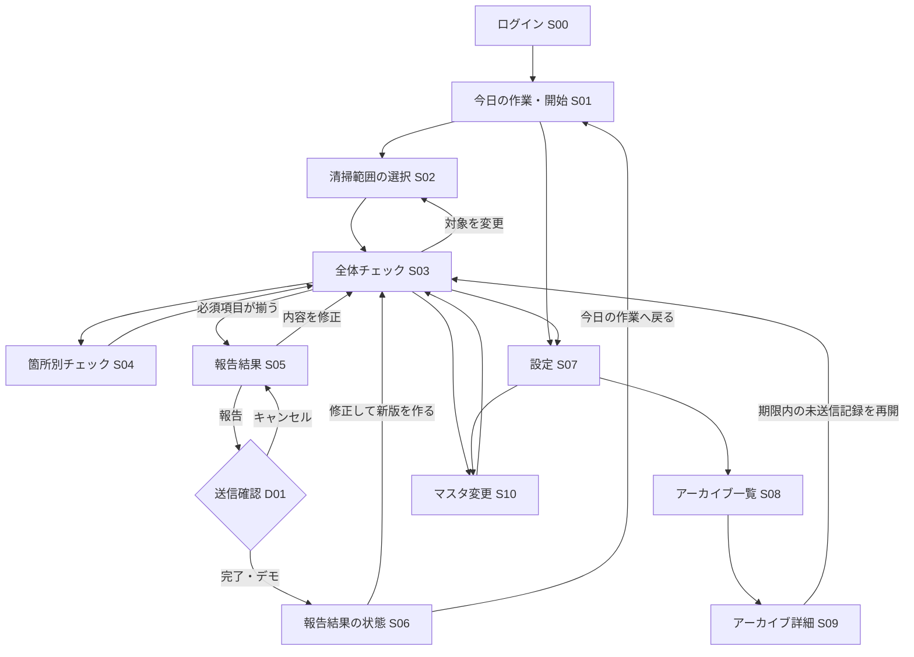

# KIIYA見落としチェッカー 画面構成・画面遷移（担当者確認用UI）

更新日: 2026-10-08

## 1. この文書の位置づけ

担当者に操作の流れを見せるため、初回のフロントエンド試作で用意する画面と遷移を確定する。画面上のログイン、保存、Chatwork送信、通知、PDF生成は**デモ表示**とし、実サービスへの接続は後の実装で行う。デモデータと操作結果は本番記録として扱わない。

画面はスマートフォン縦向きを基準にする。開始時点から「今どこにいるか」「次に何をすればよいか」「未完了はどこか」が分かる構成にする。各画面の文言は[要件定義](requirements.md)の決定事項に従う。

## 2. 画面一覧

| ID | 画面 | 見せる内容・主要操作 |
| --- | --- | --- |
| S00 | ログイン | Googleでログインする入口。試作ではデモ開始ボタンで代用し、実認証は行わない。 |
| S01 | 今日の作業・開始 | 作業日、開始時刻、本日の担当職員、スタッフ人数1〜5人、人数分の氏名入力・共有候補。設定への入口。日付が変われば新しい日の初期表示。 |
| S02 | 清掃範囲の選択 | 203〜206号室、男・女トイレ、左・中・右シャワーを選択。洗面台3か所とラウンジは常に対象として表示。 |
| S03 | 全体チェック | 対象箇所のカード、完了数・未完了数、各箇所への入口、対象変更、報告結果画面への入口。休憩の回答、備考、トラブル欄もここに置く。 |
| S04 | 箇所別チェック | 選んだ1箇所の担当者を複数選択できる。客室は宿泊人数・子どもの人数・連泊・寝具例外を入力。場所に応じた確認項目を表示。 |
| S05 | 報告結果 | 対象箇所だけの結果、担当者、休憩、備考・トラブル、Chatwork本文案、PDF／Markdown切替、プレビュー、「報告」ボタン。 |
| D01 | 送信確認ダイアログ | S05の「報告」で開く。送信先・形式を再確認し、「キャンセル」または「完了」を選ぶ。過去日付なら注意文を表示。ダイアログは独立ページにしない。 |
| S06 | 報告結果の状態 | デモ用の「送信済み」「送信失敗」「結果不明」を切り替えて表示。送信済み後の修正・再送は新しい版として見せる。 |
| S07 | 設定 | アーカイブ閲覧へのリンク、ChatworkのルームID入力と取得したルーム名、Markdown送信方法。IT担当者向けの接続管理はデモ表示で区別する。 |
| S08 | アーカイブ一覧 | 過去日の作業を一覧表示。下書き、未送信、送信済み、結果不明が判別できる。 |
| S09 | アーカイブ詳細 | 過去の対象箇所・チェック結果、報告版・送信状態を表示。対象から外した箇所は表示しない。期限内の未送信記録は再開できる見た目にする。 |
| S10 | マスタ変更 | 設備・清掃項目・客室情報の変更候補、承認取得の申告、KIIYA側スタッフ名と自分以外の職員名を自由入力。通知状態と本人向けアラートのデモ表示。 |

S04は箇所ごとに別画面を増やさず、1つの共通レイアウトを場所の種類で切り替える。S10は管理機能の**大まかな画面**までとし、マスタ編集の全項目や実際の承認・通知処理は試作範囲に含めない。

## 3. 主な画面遷移

| 場面 | 遷移・画面上の扱い |
| --- | --- |
| 入力途中 | S04からS03へ戻っても、担当者とチェックのデモ入力を保持する。S03からS02へ戻って清掃対象を変更できる。 |
| 対象変更 | 外した箇所のチェックは内部のデモ状態に残す。S05とS09では対象箇所だけを表示し、S03の備考欄で変更理由を記入できる。 |
| 報告可能条件 | 対象箇所の担当者・必須チェックと休憩の回答が揃うまで、S03の「報告結果画面へ進む」は無効。問題が見つかった項目も確認済みにでき、トラブル欄へ記入する。 |
| 「報告」 | S05の「報告」はD01を開くだけ。キャンセルでは送信しない。実製品では初回押下時刻が1週間の起算点になることを説明文で示す。 |
| 「完了」 | D01の「完了」でS06へ進む。試作では送信成功・失敗・結果不明を切り替えて見せ、実際のChatwork投稿は行わない。 |
| 日付変更 | 翌日のS01は空の新規作業として表示し、前日の記録はS07→S08から閲覧するデモを用意する。 |
| 過去日の報告 | S09から再開してS05へ進む場合、D01に「過去の日付の報告」を明示する。 |

## 4. ナビゲーションと表示上の約束

- 作業中は上部に「開始 → 対象選択 → チェック → 報告内容」の現在位置を表示する。前の画面へ戻れる。
- S03には「未完了の場所」を先に見せ、完了した場所と区別する。S04には箇所名を固定表示し、一覧へ戻る操作を置く。
- 設定とアーカイブは主作業とは別の入口にまとめる。S10はS03とS07から開けるが、試作では変更を保存・適用しない。
- デモの入力値、氏名、Chatworkルーム名は架空のサンプルと明示する。実際のrid、認証情報、職員の実名を埋め込まない。
- 実送信と誤解されないよう、D01とS06に「デモ：Chatworkには送信されません」を常に表示する。

## 5. このUI試作の完了条件

1. S00〜S10とD01をスマートフォン幅で閲覧でき、上の主な遷移をクリック・タップで辿れる。
2. 氏名入力、清掃対象、箇所別チェック、休憩、報告形式を操作でき、画面を往復しても試作中の入力値が残る。
3. 未完了時は報告結果へ進めず、完了時に進めることが画面上で分かる。
4. 対象外箇所は報告結果とアーカイブ詳細に表示されない。複数人担当と洗面台のドライヤー有無が見える。
5. 送信確認のキャンセルと「完了」、送信済み・失敗・結果不明の表示をデモ操作で確認できる。
6. 設定からアーカイブへ移動でき、翌日の新規画面と前日の記録を切り替えて見せられる。
7. 実認証・API・Chatwork・PDF生成を呼ばず、どの画面もデモであることが分かる。

## 6. 後続の実装で扱うもの

Googleログイン、サーバー保存・オフライン同期、実際のChatwork認証・投稿、PDF／Markdown生成、マスタ変更通知と再試行、保存期限に従う削除、アクセス権の厳密な判定は別の実装Issueで扱う。作業記録の共同閲覧範囲と端末紛失時の復旧方法は要件上も未決定のまま残す。

関連文書: [要件定義](requirements.md)、[状態遷移](state-transitions.md)、[API設計](api-design.md)、[テストケース](test-cases.md)、[フロントエンド技術・デプロイ方針](infrastructure-and-access.md)
