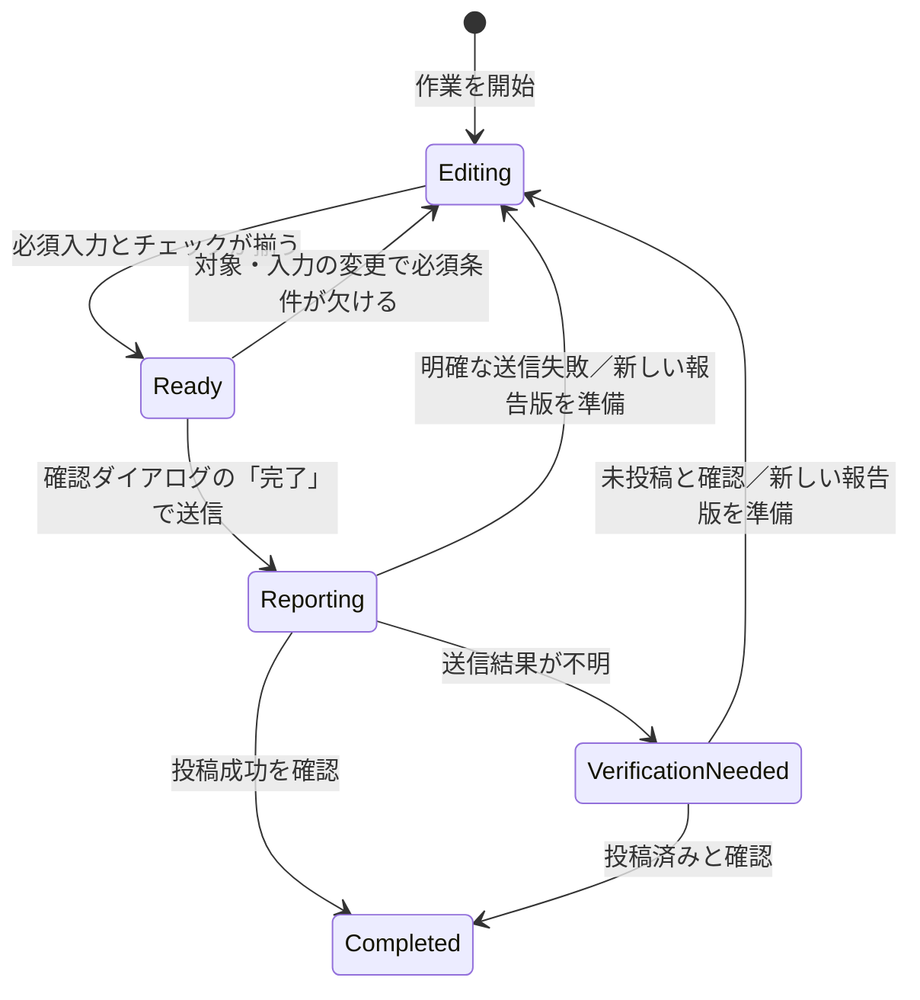
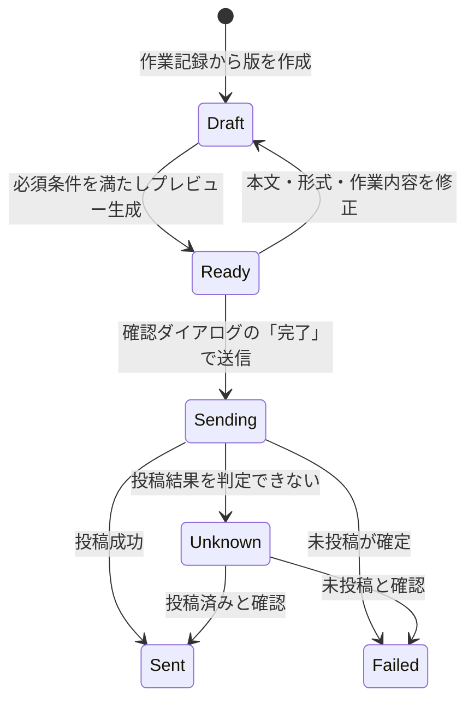
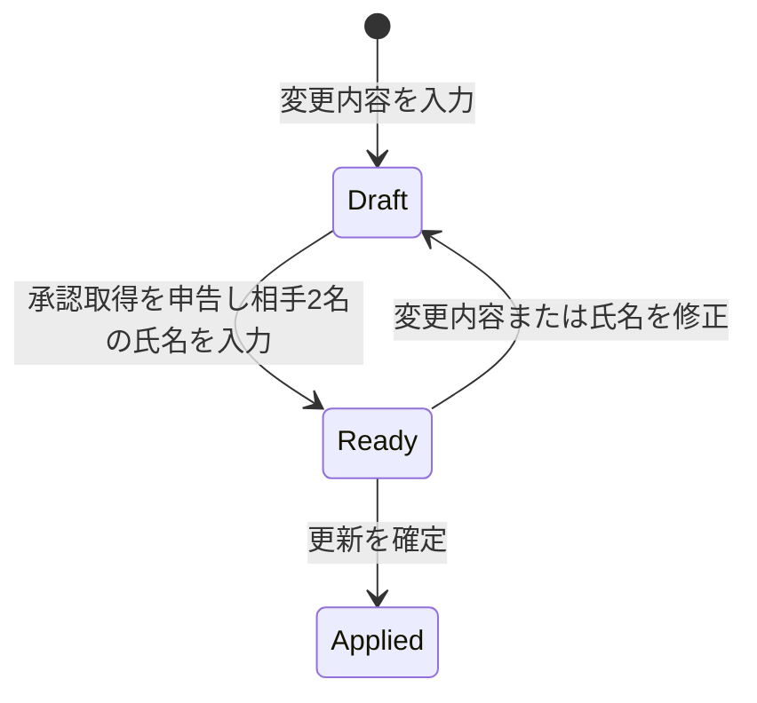
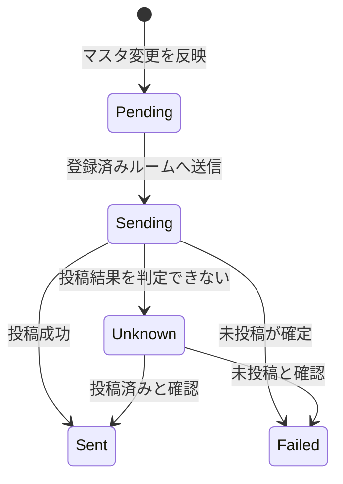

# KIIYA見落としチェッカー 状態遷移

## 1. 英語の名詞・状態名が指すもの

以下の英語は、この文書内の図とデータ項目で使う識別名。日本語の意味を先に定義する。

| 英語 | 日本語で指すもの |
| --- | --- |
| `WorkRecord` | 1回の清掃作業を表す記録。作業日、担当職員、清掃対象、チェック結果などをまとめる単位。 |
| `ReportVersion` | ある`WorkRecord`から作る報告の1つの版。送信を確定した時点の内容を固定し、修正・再送時には別の版を作る。 |
| `MasterChange` | 現場設備、清掃項目、客室マスタの1回の変更。変更内容、更新者、承認を受けた相手の氏名を含む。 |
| `Notification` | `MasterChange`を登録済みのChatworkルームへ知らせる1件の通知。報告書の送信とは別に扱う。 |
| `Editing` | 作業記録を入力・修正中で、送信前の確認をまだ終えていない状態。 |
| `Ready` | 必須項目が揃い、内容確認を経て送信へ進める状態。 |
| `Reporting` | 作業記録から確定した報告版をChatworkへ送信している状態。 |
| `VerificationNeeded` | Chatworkへの送信結果が不明で、投稿の有無を確認する必要がある状態。 |
| `Completed` | 作業記録の報告がChatworkに送信されたと確認でき、その日の操作が完了した状態。 |
| `Draft` | 報告版またはマスタ変更を作成・編集している状態。 |
| `Sending` | 報告版または通知をChatworkへ送信中の状態。 |
| `Sent` | Chatworkへの投稿が成功した、または投稿済みと確認できた状態。 |
| `Failed` | Chatworkへ投稿されていないことが分かった状態。 |
| `Unknown` | 通信断やタイムアウトなどで、Chatworkに投稿されたか判断できない状態。 |
| `Applied` | マスタ変更を保存し、以後の作業に使う内容へ反映した状態。 |
| `Pending` | マスタ変更後のChatwork通知がまだ送信されていない状態。 |

## 2. 前提と確定済みのルール

- 状態は`WorkRecord`、`ReportVersion`、`MasterChange`、`Notification`ごとに分ける。画面を移動しただけでは状態を変えない。
- チェックで問題が見つかっても、その項目は確認完了にできる。問題の内容はアプリ内のトラブル欄に追記する。
- 清掃対象を途中で変更しても、既存のチェック結果は消さない。変更した旨を備考欄へ記載する。変更後の必須項目で報告可否を再判定する。
- 報告後の修正・再送では元の`ReportVersion`を上書きせず、新しい版を作る。
- その日の操作は、Chatworkへの報告投稿が成功したと確認できた時点で完了する。送信失敗・結果不明では完了にしない〔2026-10-06承認〕。
- マスタ変更では、当日の担当職員が「承認を受けた」と申告し、KIIYA側スタッフと自分以外の職員1名の氏名を自由入力する。MVPでは承認者本人によるアプリ操作を求めない。
- 作業履歴は報告結果画面下部の「報告」ボタンの初回押下時刻から1週間残し、期限後は無期限にアーカイブする。再送でも起算点は更新しない。「報告」を一度も押していない下書きは無期限に保管する。押下後の未送信記録はアーカイブに残さず、送信結果不明が発生した事実は残す。
- アーカイブは保存上の扱いであり、`Completed`や`VerificationNeeded`などの業務状態を上書きしない。

## 3. 清掃作業の状態（`WorkRecord`）

| 状態 | 利用者に許す操作と表示 |
| --- | --- |
| `Editing` | 入力・修正・自動保存を続ける。未完了の場所と項目があれば示す。送信前の確認が終わるまで報告送信はできない。 |
| `Ready` | 入力・修正と報告プレビューを行える。通信圏外でも記録を保持するが、送信は開始しない。 |
| `Reporting` | 送信中であることを示し、同じ報告版の送信操作を重ねて受け付けない。 |
| `VerificationNeeded` | 送信結果不明と報告識別子を示す。投稿の有無が分かるまで自動再送しない。 |
| `Completed` | 送信日時と結果を示す。この作業について「本日の担当職員＝自分」の操作を完了とする。後の修正・再送は新しい報告版で扱う。 |

`Ready`は必須条件の再判定によって決まる。トラブル欄への記入だけを理由に、確認済みのチェックを未完了へ戻さない。

| 操作 | 状態と時刻への影響 |
| --- | --- |
| 全体の必須チェックが揃う | 「報告結果画面へ進む」が有効になり、`WorkRecord`は`Ready`になる。 |
| 「報告結果画面へ進む」をタップ | 報告結果画面を表示する。1週間の起算点は記録しない。 |
| 報告結果画面下部の「報告」をタップ | 確認ダイアログを表示する。初回だけ押下時刻を記録し、1週間の起算点にする。状態は`Ready`のまま。 |
| ダイアログをキャンセル | 送信せず、`Ready`のまま。記録済みの初回押下時刻は消さない。 |
| ダイアログの「完了」をタップ | 宛先・本文・形式を再確認して送信を開始し、`Reporting`へ移る。過去日付の作業ではダイアログでその旨を示し、送信内容にも明記する。 |

報告ボタン未押下の下書きと、期限後のアーカイブは無期限に保管する。アーカイブは保存上の区分であり、上の業務状態とは別に扱う。

## 4. 報告の版と送信結果（`ReportVersion`）

- `Sending`に移る直前に、その版の本文、形式、宛先、作業結果を固定する。`Sent`、`Failed`、`Unknown`の版は書き換えない。
- `Sent`後の修正・再送では、同じ`WorkRecord`に紐づく新しい`ReportVersion`を`Draft`から作る。
- `Failed`後の再送も、新しい版を作る。`Unknown`ではまず投稿の有無を確認し、未投稿と分かった場合に新しい版を作る。同じ版を無条件に再送しない。
- 版番号と元版との具体的な紐付け方法は詳細定義で決める。保存期間中は元の版と送信結果を残す。

## 5. マスタ変更と通知（`MasterChange`・`Notification`）

`MasterChange`が`Applied`になると、対応する`Notification`を`Pending`で作る。

- 承認相手2名の氏名が空欄、または職員名が当日の担当職員と同じ場合、`MasterChange`を`Ready`にしない。
- `Applied`と通知結果は別に記録し、更新後の通知が送信済みか分かるようにする。
- 通知失敗時に変更を差し戻すか、変更を維持して再通知するかは未決定。上の図は後者を**設計案**として示し、確定要件とはしない。

## 6. 詳細定義で確定する境界条件

1. 送信結果不明時に、誰がどの方法で投稿の有無を確認するか。
2. マスタ変更の通知が失敗・結果不明になった場合の再通知と更新内容の扱い。
3. 対象から外した箇所に残るチェック結果を、報告書にどう表示するか。
4. 報告版の番号付け、アーカイブの閲覧方法、通知履歴の保存期間。

関連文書: [要件定義](requirements.md)、[Chatwork認証の実装案](chatwork-auth-plan.md)
