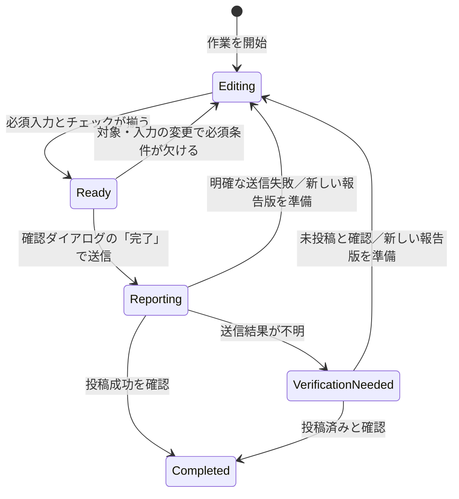
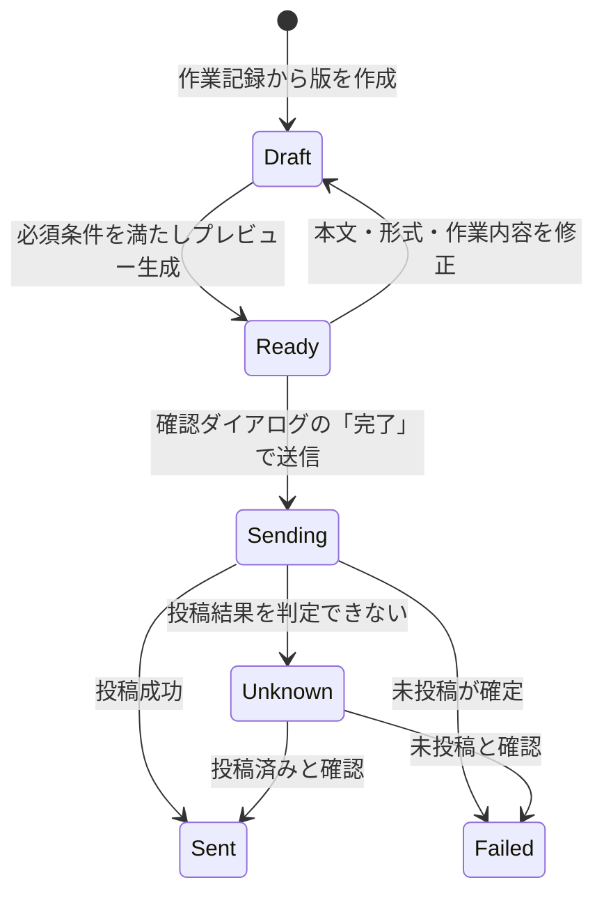
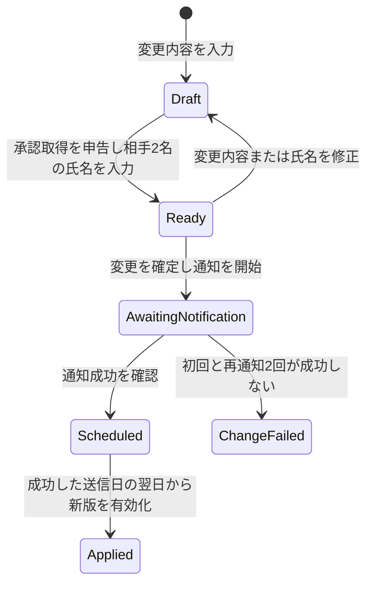
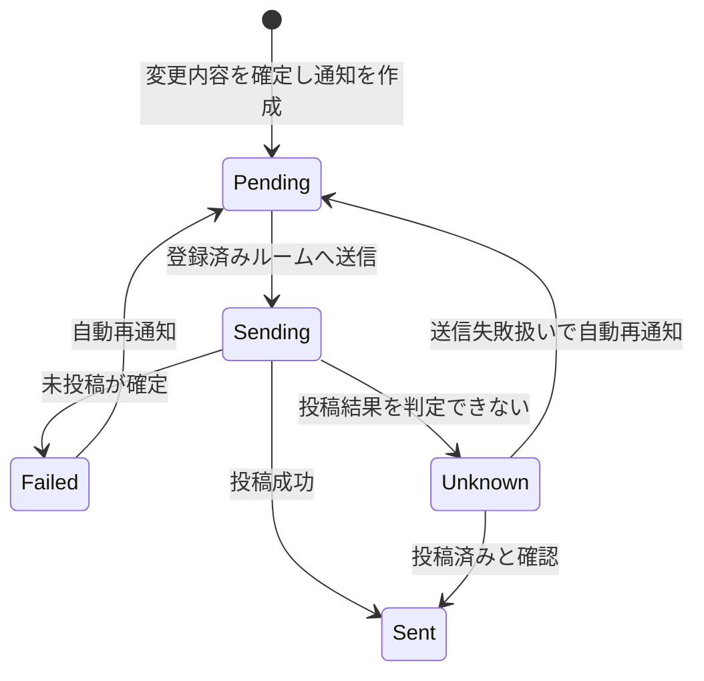

# KIIYA見落としチェッカー 状態遷移

## 1. 英語の名詞・状態名が指すもの

以下の英語は、この文書内の図とデータ項目で使う識別名。日本語の意味を先に定義する。

| 英語 | 日本語で指すもの |
| --- | --- |
| `WorkRecord` | 1回の清掃作業を表す記録。作業日、担当職員、清掃対象、チェック結果などをまとめる単位。 |
| `ReportVersion` | ある`WorkRecord`から作る報告の1つの版。送信を確定した時点の内容を固定し、修正・再送時には別の版を作る。 |
| `MasterChange` | 現場設備、清掃項目、客室マスタの1回の変更。変更内容、更新者、承認を受けた相手の氏名を含む。 |
| `Notification` | `MasterChange`を登録済みのChatworkルームへ知らせる1件の通知。報告書の送信とは別に扱う。 |
| `NotificationAttempt` | `Notification`の1回の送信試行。失敗・結果不明・成功を試行ごとに履歴へ残す。 |
| `Editing` | 作業記録を入力・修正中で、送信前の確認をまだ終えていない状態。 |
| `Ready` | 必須項目が揃い、内容確認を経て送信へ進める状態。 |
| `Reporting` | 作業記録から確定した報告版をChatworkへ送信している状態。 |
| `VerificationNeeded` | Chatworkへの送信結果が不明で、投稿の有無を確認する必要がある状態。 |
| `Completed` | 作業記録の報告がChatworkに送信されたと確認でき、その日の操作が完了した状態。 |
| `Draft` | 報告版またはマスタ変更を作成・編集している状態。 |
| `Sending` | 報告版または通知をChatworkへ送信中の状態。 |
| `Sent` | Chatworkへの投稿が成功した、または投稿済みと確認できた状態。 |
| `Failed` | Chatworkへ投稿されていないことが分かった状態。 |
| `Unknown` | 通信断やタイムアウトなどで、Chatworkに投稿されたか判断できない状態。 |
| `AwaitingNotification` | マスタ変更の内容を確定し、Chatwork通知の成否を待っている状態。新版はまだ適用しない。 |
| `Scheduled` | Chatwork通知に成功し、新版を翌日から適用する予定の状態。 |
| `Applied` | 新版が有効になり、その日以降に開始する作業で使われる状態。 |
| `ChangeFailed` | 初回送信と最大2回の自動再通知が成功せず、マスタ変更が不成立となった状態。新版を適用しない。 |
| `Pending` | マスタ変更のChatwork通知がまだ送信されていない状態。 |

## 2. 前提と確定済みのルール

- 状態は`WorkRecord`、`ReportVersion`、`MasterChange`、`Notification`ごとに分ける。画面を移動しただけでは状態を変えない。
- チェックで問題が見つかっても、その項目は確認完了にできる。問題の内容はアプリ内のトラブル欄に追記する。
- 清掃対象を途中で変更しても、既存のチェック結果は消さない。変更した旨を備考欄へ記載する。変更後の必須項目で報告可否を再判定し、報告書と履歴画面には現在の対象箇所だけを表示する。
- 報告後の修正・再送では元の`ReportVersion`を上書きせず、新しい版を作る。
- その日の操作は、Chatworkへの報告投稿が成功したと確認できた時点で完了する。送信失敗・結果不明では完了にしない〔2026-10-06承認〕。
- マスタ変更では、当日の担当職員が「承認を受けた」と申告し、KIIYA側スタッフと自分以外の職員1名の氏名を自由入力する。MVPでは承認者本人によるアプリ操作を求めない。
- マスタの新版はChatwork通知が成功した**送信日（日本時間）の翌日**から開始する作業に適用する。23:59までに成功すれば翌日、日付が変わってから成功すればそのさらに翌日となる。すでに開始した作業には自動適用しない。通知失敗・結果不明の試行は送信失敗扱いで履歴に残し、変更を適用せず、更新操作をした本人にだけアプリ内アラートを出す。初回送信後、失敗・結果不明が確定するたび5分後に最大2回自動再通知する。
- マスタ変更の通知履歴は最終結果が確定した時刻から1週間保存する。これは作業履歴の1週間とは別の期限とする。
- 日付が変わると当日の入力画面を新しい日の初期状態へ戻す。前日の`WorkRecord`は設定画面のアーカイブ閲覧リンクから参照でき、画面のリセットで記録を消去しない。
- 報告ボタン未押下の下書きと送信済み記録は無期限に保管する。報告ボタン押下後も未送信の記録は初回押下から1週間、翌日以降はアーカイブ閲覧ページで見られる。期限後は未送信の本文・記録を削除し、送信結果不明が発生した事実は消さずに残す。再送でも起算点を更新しない。
- アーカイブへの表示切替は保存上の扱いであり、`Completed`や`VerificationNeeded`などの業務状態を上書きしない。

## 3. 清掃作業の状態（`WorkRecord`）

| 状態 | 利用者に許す操作と表示 |
| --- | --- |
| `Editing` | 入力・修正・自動保存を続ける。未完了の場所と項目があれば示す。送信前の確認が終わるまで報告送信はできない。 |
| `Ready` | 入力・修正と報告プレビューを行える。通信圏外でも記録を保持するが、送信は開始しない。 |
| `Reporting` | 送信中であることを示し、同じ報告版の送信操作を重ねて受け付けない。 |
| `VerificationNeeded` | 送信結果不明と報告識別子を示す。投稿の有無が分かるまで自動再送しない。 |
| `Completed` | 送信日時と結果を示す。この作業について「本日の担当職員＝自分」の操作を完了とする。後の修正・再送は新しい報告版で扱う。 |

`Ready`は必須条件の再判定によって決まる。トラブル欄への記入だけを理由に、確認済みのチェックを未完了へ戻さない。

| 操作 | 状態と時刻への影響 |
| --- | --- |
| 全体の必須チェックが揃う | 「報告結果画面へ進む」が有効になり、`WorkRecord`は`Ready`になる。 |
| 「報告結果画面へ進む」をタップ | 報告結果画面を表示する。1週間の起算点は記録しない。 |
| 報告結果画面下部の「報告」をタップ | 確認ダイアログを表示する。初回だけ押下時刻を記録し、1週間の起算点にする。状態は`Ready`のまま。 |
| ダイアログをキャンセル | 送信せず、`Ready`のまま。記録済みの初回押下時刻は消さない。 |
| ダイアログの「完了」をタップ | 宛先・本文・形式を再確認して送信を開始し、`Reporting`へ移る。過去日付の作業ではダイアログでその旨を示し、送信内容にも明記する。 |

日付変更時に前日の記録はアーカイブ閲覧ページへ移る。未送信の記録は初回「報告」押下から1週間で削除する。報告ボタン未押下の下書きと送信済みの記録は、過去の記録となっても無期限に保管する。

## 4. 報告の版と送信結果（`ReportVersion`）

- `Sending`に移る直前に、その版の本文、形式、宛先、作業結果を固定する。`Sent`、`Failed`、`Unknown`の版は書き換えない。
- `Sent`後の修正・再送では、同じ`WorkRecord`に紐づく新しい`ReportVersion`を`Draft`から作る。
- `Failed`後の再送も、新しい版を作る。`Unknown`ではまず投稿の有無を確認し、未投稿と分かった場合に新しい版を作る。同じ版を無条件に再送しない。
- 版番号と元版との具体的な紐付け方法は詳細定義で決める。保存期間中は元の版と送信結果を残す。

## 5. マスタ変更と通知（`MasterChange`・`Notification`）

`MasterChange`が`AwaitingNotification`になると、対応する`Notification`を`Pending`で作る。失敗または結果不明の試行があっても、自動再通知中は`AwaitingNotification`のままで新版を適用しない。履歴には試行ごとの結果を残す。

- 承認相手2名の氏名が空欄、または職員名が当日の担当職員と同じ場合、`MasterChange`を`Ready`にしない。
- 通知試行が`Failed`または`Unknown`になった場合、更新操作をした本人にだけアプリ内アラートを表示する。履歴上はどちらも送信失敗扱いとし、`Unknown`だった事実も併記する。再通知の各試行は別の`NotificationAttempt`として残す。
- `Unknown`の再通知前には、通知本文に含めた変更IDをルームの直近メッセージで照合する案とする。投稿済みと確認できた場合は元の投稿日時を成功日として`Sent`に進める。見つからなければ自動再通知する。取得範囲に限りがあるため、重複投稿を完全には防げない。
- 通知が`Sent`になった場合、変更は`Scheduled`となり、成功した送信日（日本時間）の翌日から新版を有効化する。適用前に開始した`WorkRecord`は旧版を使い続ける。
- 初回送信に加えて、失敗・結果不明の判定から5分後に最大2回再通知する。投稿済みとの照合に成功した場合は再通知せず`Sent`へ進める。3回の送信試行がいずれも成功せず、投稿済みとも確認できなければ`ChangeFailed`として打ち切り、新版を適用しない。通知と各試行の履歴は最終結果確定から1週間保存する。

## 6. 詳細定義で確定する境界条件

1. 送信結果不明時に、誰がどの方法で投稿の有無を確認するか。
2. マスタ変更の承認記録と変更記録の保存期間。
3. 報告版の番号付け。

関連文書: [要件定義](requirements.md)、[Chatwork認証の実装案](chatwork-auth-plan.md)
